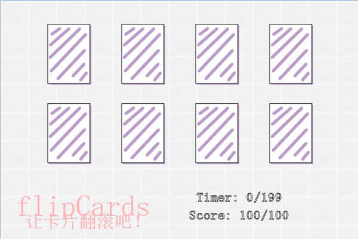

1 - the second game demo from learning Greenfoot

## flipCards

### Intro

It's totally a game, made by Greenfoot. And I named it "flipCards".

What is "flipCards"? It's a puzzle game with cards to be clicked and picked by pair.

The story is about secret cards from heavens, flip into couples.

The goal of this game is simple and awesome: sent all couples home.

"flipCards" is published on  https://www.greenfoot.org/scenarios/23891 and you can goto play on-line. Since the game is built under the [LICENSE](./LICENSE) of GPL 3.0 so you can share it under it. If there were anything wrong, feel free to leave messages to let me know or fix. Thanks.

## 让卡片翻滚吧！

### 简介

通过Greenfoot制作而成，我把它命名为《让卡片翻滚吧！》。

这是一款益智游戏，可以点击并选择卡片。

故事是关于来自天上的神秘卡片们，本是一对对，双宿双飞。

游戏的目标就是把所有夫妻送回家。

《让卡片翻滚吧！》发布在https://www.greenfoot.org/scenarios/23891 上。游戏是在GPL 3.0的许可证下构建的，因此您分享的时候请遵守哦！如果有任何问题，请随时留言让我知道或解决。谢谢。